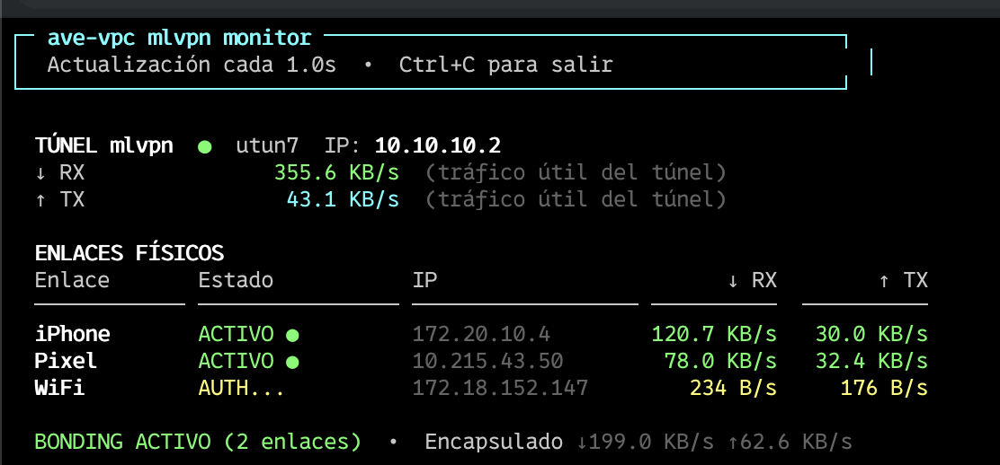

# ave-vpc — Bonding de conexiones móviles para el AVE

[](LICENSE)
[](https://www.gnu.org/software/bash/)
[](https://www.apple.com/macos/)

Agrega múltiples conexiones móviles en tiempo real usando [mlvpn](https://github.com/zehome/MLVPN). Diseñado para trayectos de tren de larga distancia donde la cobertura es inestable y las videollamadas se interrumpen.

El servidor mlvpn puede ser **un VPS gratuito en Oracle Cloud** o **una Raspberry Pi en casa** conectada a la fibra óptica. Ambas opciones usan los mismos scripts de cliente en el Mac.

**El resultado:** si un enlace móvil cae, el tráfico continúa por el otro sin corte visible. Si ambos funcionan, el ancho de banda se suma.

---

## Tabla de contenidos

- [Problema que resuelve](#problema-que-resuelve)
- [Arquitectura](#arquitectura)
- [Bonding vs Failover](#bonding-vs-failover)
- [Requisitos](#requisitos)
- [Instalación — Opción A: Oracle Cloud (gratis)](#instalación--opción-a-oracle-cloud-gratis)
- [Instalación — Opción B: Raspberry Pi en casa](#instalación--opción-b-raspberry-pi-en-casa)
- [Uso diario](#uso-diario)
- [Estructura del proyecto](#estructura-del-proyecto)
- [Configuración](#configuración)
- [Tercer enlace WiFi (automático)](#tercer-enlace-wifi-automático)
- [Solución de problemas](#solución-de-problemas)
- [Contribuir](#contribuir)
- [Licencia](#licencia)

---

## Problema que resuelve

En el AVE (Orihuela/Murcia → Madrid, y vuelta), la cobertura móvil es inestable. Cada vez que el tren pasa por un túnel o cambia de antena, la conexión se interrumpe. Con una única SIM:

- La VPN corporativa se cae y hay que reconectar manualmente
- Las videollamadas (Teams, Meet, Zoom) se cortan
- El streaming se para

Con dos SIMs de operadoras distintas y este proyecto, los cortes de una se cubren con la otra.

---

## Arquitectura

mlvpn distribuye los paquetes entre los dos enlaces activos simultáneamente. El servidor los reensambla en orden y los envía a internet. El tráfico de vuelta sigue el mismo camino inverso.

### Opción A — Oracle Cloud

```
  [ En el AVE ]                            [ Madrid ]
                                        ┌─────────────────┐
       Mac                              │  Oracle Cloud   │
  10.10.10.2 ── mlvpn ─── UDP:5080 ────│  10.10.10.1     │── internet
                       \── UDP:5081 ────│  mlvpn0         │
                            │           └─────────────────┘
                   ┌────────┴────────┐
              iPhone (WiFi)   Pixel (USB)
              Movistar          Yoigo
```

### Opción B — Raspberry Pi en casa

```
  [ En el AVE ]                       [ Tu casa ]
                                   ┌──────────────────────────────┐
       Mac                         │ Router fibra                 │
  10.10.10.2 ── mlvpn ─ UDP:5080 ──│→ port forward → RPi 4       │── internet
                       ─ UDP:5081 ──│→ port forward │ 10.10.10.1  │   (fibra)
                            │       │               └─────────────│
                   ┌────────┴────────┐  tu-hostname.dedyn.io   │
              iPhone (WiFi)   Pixel (USB)   (DDNS → IP dinámica)  │
              Movistar          Yoigo  └──────────────────────────┘
```

El Mac se conecta al hostname DDNS (siempre actualizado por el router), que apunta a tu IP pública dinámica de casa. El router reenvía los puertos UDP a la RPi.

---

## Bonding vs Failover

| | Failover | Bonding (este proyecto) |
|--|----------|--------------------------|
| Interfaces activas | 1 (la otra espera) | Todas a la vez |
| Ancho de banda efectivo | max(A, B) | A + B |
| Si cae un enlace | Corte de 2–6 s | Sin corte visible |
| Distribución de paquetes | Todo por un camino | Repartido entre todos |

---

## Requisitos

### Hardware

| Dispositivo | Función | Notas |
|-------------|---------|-------|
| Mac (macOS 13+) | Cliente, ejecuta los scripts | Apple Silicon o Intel |
| iPhone con SIM | Enlace 1 — hotspot WiFi | Cualquier operadora |
| Android con SIM | Enlace 2 — tethering USB | Mejor si es operadora distinta |
| Cable USB-A/C | Conectar el Android al Mac | |

### Software en el Mac

- **Homebrew** — [brew.sh](https://brew.sh)
- **Xcode Command Line Tools** — `xcode-select --install`
- **Terraform** — `brew install terraform`
- **Git** — incluido en Xcode CLT

Los scripts instalan automáticamente el resto de dependencias (libev, libsodium, etc.).

> **Nota macOS**: mlvpn compila desde fuente. El script `03-setup-mac.sh` aplica
> automáticamente los workarounds necesarios para macOS (incompatibilidad de `strnvis`
> en `setproctitle.c`). No se requiere ninguna acción manual.

### Servidor mlvpn (elige uno)

**Opción A — Oracle Cloud (gratis permanente):**
- Cuenta en [Oracle Cloud Free Tier](https://cloud.oracle.com)
- Ubuntu 26.04 LTS, IP pública IPv4
- Puertos UDP 5080, 5081 y 5082 abiertos (Terraform los configura automáticamente)

> ⚠️ **Aviso**: Las VMs gratuitas de Oracle Cloud (especialmente las ARM A1.Flex)
> tienen muy poca disponibilidad. Es habitual esperar días o semanas hasta que
> Oracle asigne capacidad, y en algunas regiones nunca llega. Si no quieres
> esperar, usa directamente la **Opción B** (Raspberry Pi).

**Opción B — Raspberry Pi en casa (~167€ una sola vez):**
- Raspberry Pi 4 (4GB) + carcasa pasiva + microSD + fuente USB-C
- Router con port forwarding y DDNS
- Ver lista de la compra y guía completa en [`docs/rpi-setup.md`](docs/rpi-setup.md)

> ⚠️ **CGNAT**: Muchos ISPs residenciales en España usan CGNAT (la IP WAN del router
> empieza por `100.x.x.x`), lo que impide recibir conexiones desde internet aunque
> configures port forwarding. Verifica antes de montar la RPi: si `ip route show default`
> en el router muestra una gateway `100.x.x.x`, tienes CGNAT. Solución: pide a tu ISP
> que te retire el CGNAT (muchos lo hacen gratis con una llamada de soporte).

---

## Instalación — Opción A: Oracle Cloud (gratis)

### 1. Clonar el repositorio

```bash
git clone https://github.com/<tu-usuario>/ave-vpc.git
cd ave-vpc
```

### 2. Configurar variables

```bash
cp config/env.example config/env
# Edita config/env — al menos VPS_IP y los IFACE_* (paso 6 los detecta automáticamente)
```

### 3. Provisionar el VPS automáticamente

> ⚠️ **Esto puede tardar días o no conseguirse nunca.** Oracle limita la
> disponibilidad de las VMs gratuitas (sobre todo ARM) por región. El script
> reintenta automáticamente cada hora, pero si tras varios días no hay suerte,
> considera la Opción B (Raspberry Pi) o un VPS de pago desde €2/mes en
> Vultr, IONOS o Hetzner.

El script lo intenta cada hora hasta conseguirlo (se para solo cuando lo logra).

Primero configura las credenciales OCI siguiendo [`docs/oracle-cloud-setup.md`](docs/oracle-cloud-setup.md), luego:

```bash
cp terraform/terraform.tfvars.example terraform/terraform.tfvars
# Edita terraform/terraform.tfvars con tu tenancy OCID

# Inicia el proceso automático
./06-provision-vps.sh --setup-cron

# Seguir el progreso
tail -f generated/provision.log
```

Cuando el VPS se crea, el script actualiza `config/env` con la IP y envía una notificación macOS.

> Si no quieres esperar o no hay capacidad disponible, usa la Opción B (Raspberry Pi en casa) o un VPS de pago en Vultr, IONOS o Hetzner desde €2/mes.

### 4. Generar el secreto compartido

```bash
./01-generar-secreto.sh
```

Crea `keys/mlvpn.secret`. **Nunca lo subas a git** (ya está en `.gitignore`).

### 5. Configurar el VPS

```bash
./02-setup-vps.sh
```

Se conecta por SSH y hace todo: instala dependencias, compila mlvpn, configura NAT/IP forwarding y crea el servicio systemd. Tarda ~5 minutos.

### 6. Configurar el Mac

```bash
./03-setup-mac.sh
```

Instala dependencias con Homebrew, compila mlvpn y genera `generated/mlvpn.conf`.

### 7. Detectar interfaces (una vez, con los móviles conectados)

```bash
# Con el iPhone en hotspot WiFi y el Android conectado por USB con tethering activo:
./00-detectar-interfaces.sh
```

Detecta automáticamente las interfaces de red y actualiza `config/env`.

### 8. Verificar el setup

```bash
./tests/verificar-setup.sh
```

Comprueba que todo está correcto antes del primer viaje.

---

## Instalación — Opción B: Raspberry Pi en casa

Una Raspberry Pi 4 conectada a la fibra de casa funciona como servidor mlvpn
en lugar del VPS. El Mac en el tren se conecta a través del router usando un
hostname DDNS que siempre apunta a tu IP de casa.

Ver la guía completa en [`docs/rpi-setup.md`](docs/rpi-setup.md), que incluye
lista de la compra, setup headless sin monitor, configuración del router y DDNS.

Pasos resumidos:

```bash
# 1. Grabar Ubuntu Server 26.04 LTS en la microSD con Raspberry Pi Imager
#    (activar SSH con tu clave pública en el Imager antes de grabar)

# 2. Configurar en el router:
#    - Port Forwarding: UDP 5080 y 5081 → IP local de la RPi
#    - DDNS: apuntar un hostname a tu IP pública dinámica

# 3. Rellenar config/env con la IP local de la RPi
#    RPi_IP="192.168.1.XXX"
#    RPi_USER="TU_USUARIO"

# 4. Generar secreto y configurar la RPi
./01-generar-secreto.sh
./07-setup-rpi.sh

# 5. Actualizar VPS_IP con el hostname DDNS y configurar el Mac
#    VPS_IP="tu-hostname.dedyn.io"  (en config/env)
./03-setup-mac.sh
```

A partir de aquí, `./04-conectar.sh` funciona exactamente igual que con Oracle Cloud.

---

## Uso diario

### Antes de subir al tren

1. Activa el hotspot WiFi del iPhone y conéctate desde el Mac
2. Conecta el Android por USB y activa el tethering

### En el tren

```bash
# Desde Terminal.app:
sudo ./04-conectar.sh

# Desde Claude Code (Macs con Jamf/MDM donde sudo sin TTY falla):
SUDO_ASKPASS=/tmp/sudo-askpass.sh sudo -A ./04-conectar.sh
# El askpass lo crea 03-setup-mac.sh automáticamente
```

Verifica que el tráfico pasa por el tunel:

```bash
ping 10.10.10.1                    # debe responder el servidor
traceroute 8.8.8.8                 # hop 1 debe ser 10.10.10.1
curl ifconfig.me                   # debe mostrar la IP del servidor
```

Monitoriza el bonding en tiempo real:

```bash
python3 ./08-monitor.py            # throughput por enlace + agregado
```



*Captura real durante un trayecto en el AVE el 20/05/2026: iPhone
(Movistar) y Pixel (Yoigo) activos sumando ~199 KB/s, WiFi del AVE en
`AUTH...` porque el ISP del tren filtra el puerto 5082. La variable
opcional `MLVPN_PORT_3_REMOTE="443"` permite que el cliente conecte a
443/UDP (QUIC, casi siempre permitido) y el router de casa rewrite el
paquete al 5082 interno donde mlvpn escucha — ver sección [Tercer
enlace WiFi](#tercer-enlace-wifi-automático).*

Logs de mlvpn (van a syslog, no a un fichero plano):

```bash
log stream --predicate 'process == "mlvpn"' --info   # macOS, en vivo
log show   --predicate 'process == "mlvpn"' --info --last 5m   # últimos 5 min
```

> El fichero `generated/mlvpn.log` solo captura errores tempranos de
> arranque (antes de que mlvpn abra syslog) y los rebind del watcher
> de IP del WiFi. El tráfico runtime no aparece ahí; usa `log stream`.

### Al llegar

```bash
sudo ./05-desconectar.sh
# o con askpass:
SUDO_ASKPASS=/tmp/sudo-askpass.sh sudo -A ./05-desconectar.sh
```

---

## Estructura del proyecto

```
ave-vpc/
├── 00-detectar-interfaces.sh   # Detecta interfaces iPhone/Android automáticamente
├── 01-generar-secreto.sh       # Genera el secreto de cifrado mlvpn
├── 02-setup-vps.sh             # Configura el VPS (ejecutar una vez)
├── 03-setup-mac.sh             # Configura el Mac (ejecutar una vez)
├── 04-conectar.sh              # Conectar en el tren (requiere sudo)
├── 05-desconectar.sh           # Desconectar al llegar (requiere sudo)
├── 06-provision-vps.sh         # Provisiona el VPS en Oracle Cloud (auto-retry)
├── 07-setup-rpi.sh             # Configura una Raspberry Pi como servidor (opción B)
├── 08-monitor.py               # Monitor en tiempo real: throughput por enlace + agregado
├── patches/
│   └── tuntap_darwin_utun.c    # Parche utun para macOS (API nativa, sin kext)
├── config/
│   └── env.example             # Plantilla de configuración
├── docs/
│   ├── oracle-cloud-setup.md   # Guía para obtener credenciales OCI
│   ├── rpi-setup.md            # Guía Raspberry Pi: lista de compra, DDNS, router
│   └── screenshots/            # Capturas para README (monitor en vivo, etc.)
├── generated/                  # Archivos en tiempo de ejecución (gitignored)
│   ├── mlvpn.conf              # Configuración del cliente mlvpn
│   ├── mlvpn.log               # Log de mlvpn
│   └── provision.log           # Log del proceso de provisión
├── keys/                       # Secreto compartido (gitignored)
│   └── mlvpn.secret
├── requirements/
│   └── REQ.md                  # Requisitos del sistema
├── terraform/
│   ├── main.tf                 # Infraestructura Oracle Cloud
│   ├── variables.tf
│   ├── outputs.tf
│   └── terraform.tfvars.example
└── tests/
    └── verificar-setup.sh      # Tests de verificación del setup
```

---

## Configuración

Todas las variables viven en `config/env` (creado a partir de `config/env.example`).

| Variable | Descripción | Valor por defecto |
|----------|-------------|-------------------|
| `VPS_IP` | IP o hostname DDNS del servidor (Oracle Cloud o RPi) | *(rellenar)* |
| `VPS_USER` | Usuario SSH del servidor | `ubuntu` |
| `VPS_SSH_PORT` | Puerto SSH | `22` |
| `MLVPN_PORT_1` | Puerto UDP enlace 1 (iPhone) | `5080` |
| `MLVPN_PORT_2` | Puerto UDP enlace 2 (Android) | `5081` |
| `MLVPN_PORT_3` | Puerto UDP enlace 3 (WiFi opcional, bindport servidor) | `5082` |
| `MLVPN_PORT_3_REMOTE` | Puerto UDP público al que conecta el cliente (si difiere de `MLVPN_PORT_3` el router hace mapeo) | *(igual a `MLVPN_PORT_3`)* |
| `TUN_VPS_IP` | IP del servidor en el túnel | `10.10.10.1` |
| `TUN_MAC_IP` | IP del Mac en el túnel | `10.10.10.2` |
| `TUN_MTU` | MTU del túnel | `1440` |
| `IFACE_IPHONE` | Interfaz USB iPhone (tethering) | `en8` |
| `IFACE_PIXEL` | Interfaz USB Android | `en12` |
| `IFACE_WIFI` | Interfaz WiFi nativa del Mac (3er enlace) | `en0` |
| `RPi_IP` | IP local de la RPi (solo opción B, para el setup) | *(rellenar)* |
| `RPi_USER` | Usuario SSH de la RPi (solo opción B) | `ubuntu` |

---

## Tercer enlace WiFi (automático)

`04-conectar.sh` evalúa el WiFi del Mac (`IFACE_WIFI`, por defecto `en0`) en cada arranque y lo añade al bonding **solo si pasa los pre-flight checks**. Si no, sigue con los 2 móviles sin error.

### Pre-flight checks

En orden:

1. **Flag `--sin-wifi`** → se omite siempre
2. **Sin IP en `IFACE_WIFI`** → no hay WiFi conectada, se omite
3. **Red de casa** → si la IP del Mac está en la subred de `RPi_IP` y el RPi local responde a ping, se omite con aviso (evita el viaje absurdo Mac→router→WAN→router→RPi)
4. **Captive portal** → HTTP a `captive.apple.com/hotspot-detect.html`; si la respuesta no es exactamente `<TITLE>Success</TITLE>` se asume captive y se omite con mensaje "autentica en el navegador y reejecuta"
5. **Si todos OK** → se anexa `[links.wifi]` al bonding con `bindhost = IP_WIFI` y `remoteport = MLVPN_PORT_3_REMOTE` (que por defecto es igual a `MLVPN_PORT_3`, ver más abajo "Puerto público alternativo")

### Matriz de comportamiento

| Escenario | IP | Captive | UDP | Resultado |
|---|---|---|---|---|
| WiFi apagada | ✗ | – | – | 2 enlaces, sin error |
| Casa (subred RPi) | ✓ | – | – | 2 enlaces, aviso "red de casa" |
| Captive pre-auth (hotel/AVE) | ✓ | ✓ | – | 2 enlaces, aviso "autentica y reejecuta" |
| Hotel/AVE post-auth, UDP libre | ✓ | ✗ | ✓ | **3 enlaces activos** |
| Hotel/oficina, UDP filtrado | ✓ | ✗ | ✗ | 3 enlaces, WiFi en `AUTH_PENDING` (visible en monitor) |

### Forzar 2 enlaces

```bash
sudo ./04-conectar.sh --sin-wifi
```

### Puerto público alternativo (`MLVPN_PORT_3_REMOTE`)

Las redes WiFi públicas restrictivas (AVE, aeropuertos, hoteles, redes corporativas) suelen filtrar puertos altos arbitrarios como 5082 pero dejan pasar **443/UDP (QUIC)**. Para vencer ese filtro sin tocar el core de mlvpn:

1. Define en `config/env`:
   ```bash
   MLVPN_PORT_3_REMOTE="443"
   ```
2. En el router de casa, añade una regla extra de port forwarding:
   ```
   WAN 443/UDP  →  IP_LOCAL_RPi 5082/UDP
   ```
   Mantén también la regla `5082/UDP → 5082/UDP` para conservar el flujo directo.

El cliente conecta a `200bares.dedyn.io:443/UDP`, el router rewrite a `192.168.1.101:5082`, y el `mlvpn` server (que sigue escuchando en 5082) ni se entera. Reversible cambiando `MLVPN_PORT_3_REMOTE` (o quitándolo).

### Requisitos en el servidor

`07-setup-rpi.sh` (o `02-setup-vps.sh`) abren el puerto UDP `MLVPN_PORT_3` en el firewall y añaden `[links.wifi]` con `bindport = ${MLVPN_PORT_3}` a la configuración de mlvpn. Si actualizas `MLVPN_PORT_3` en `config/env`, vuelve a ejecutar `07-setup-rpi.sh` para propagar los cambios.

---

## Solución de problemas

**El túnel se crea pero no hay internet**
```bash
# Verificar IP forwarding en el VPS
ssh ubuntu@$VPS_IP "sudo sysctl net.ipv4.ip_forward"
# Debe devolver: net.ipv4.ip_forward = 1

# Verificar NAT
ssh ubuntu@$VPS_IP "sudo iptables -t nat -L POSTROUTING -n"
# Debe haber una regla MASQUERADE
```

**mlvpn no conecta (timeout)**
```bash
# Ver logs en tiempo real
tail -f generated/mlvpn.log

# Verificar que los puertos UDP están accesibles
nc -uzv $VPS_IP 5080 && echo "5080 OK"
nc -uzv $VPS_IP 5081 && echo "5081 OK"
```

**El Android no se detecta como interfaz**
```bash
# Asegúrate de que el tethering USB está activo en el Android
# Luego ejecuta:
networksetup -listallhardwareports
# Busca una entrada nueva que aparezca al conectar el cable
```

**El cron de provisión no funciona**
```bash
# Verificar que está registrado
crontab -l | grep ave-vpc

# Ver log
tail -20 generated/provision.log

# Lanzar manualmente para depurar
NO_JITTER=1 ./06-provision-vps.sh
```

---

## Contribuir

Lee [`CONTRIBUTING.md`](CONTRIBUTING.md) antes de abrir un PR.

---

## Licencia

[MIT](LICENSE)
